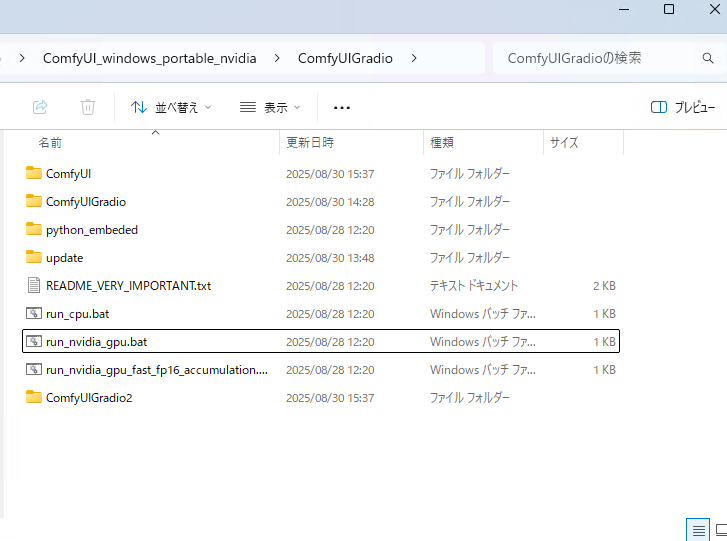
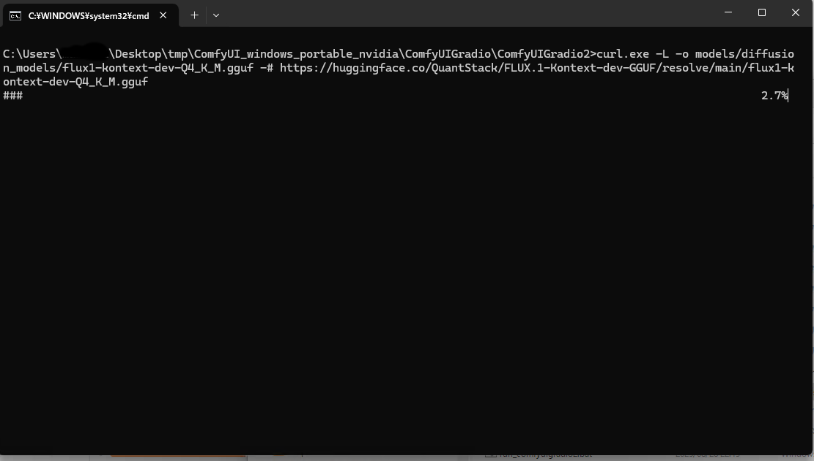
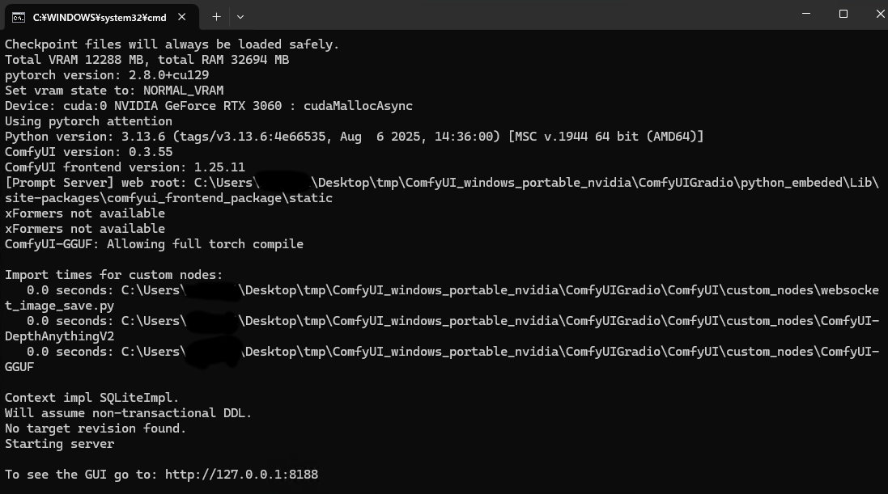
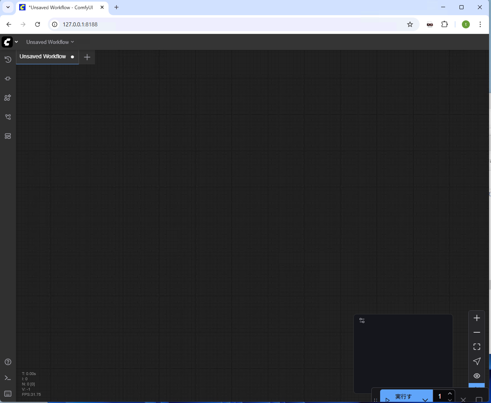
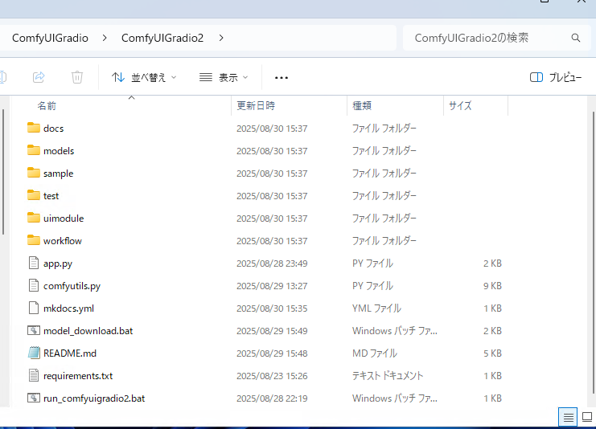

# Windows でのインストールと実行

## インストール

通常の [ComfyUI](https://www.comfy.org/download) でも動きますが、
[ComfyUIGradio](https://github.com/asfdrwe/ComfyUIGradio)に含まれる ComfyUI で
動作するので、こちらをインストールしてください。

もし、通常の ComfyUI を使用する場合、カスタムノードとして
[ComfyUI-GGUF](https://github.com/city96/ComfyUI-GGUF)と
[ComfyUI-DepthAnythingV2](https://github.com/kijai/ComfyUI-DepthAnythingV2)
をインストールしてください。

[こちら](https://huggingface.co/asfdrwe/WAI14DMD2-GGUF/resolve/main/ComfyUIGradio2-20250910.zip)をクリックして
ComfyUIGradio2 をダウンロードしてください。ComfyUIGradio2 をインストールしたい
フォルダにファイルを移動させ、右クリックしすべて展開を選びファイルを展開してください。
ComfyGradio のフォルダに展開するとこうなります。



## モデルのダウンロード
FLUX Kontext と Wan2.2 I2V と Wan2.2 S2V と Qwen Image Edit のモデルをまとめて
ダウンロードできるツールを用意してあります。
ComfyUIGradio2 フォルダ内にある`model_download.bat` をダブルクリックして実行し、
`models` フォルダを丸ごと ComfyUI フォルダに移動させてください。

ComfyUIGradio に含まれる ComfyUI を利用している場合、モデルファイルが 2 つ
重複していますが、上書きして問題ありません。



50GB 程度ダウンロードするので、ストレージの容量と通信回線容量に気を付けてください。

SDXL モデルは
[WAI-NSFW-illustrious-SDXL-v14.0](https://civitai.com/models/827184/wai-nsfw-illustrious-sdxl)
などをダウンロードして、ComfyUI をインストールしたフォルダの models フォルダの checkpoints フォルダに移動させてください。

## 実行
ComfyUI を先に起動してください。ComfyUI のポータブル版や ComfyUIGradio の ComfyUI の場合は、
`run_nvidia_gpu.bat` をダブルクリックしてください。自動でブラウザが開かれるまで待っていてください。



開かれたブラウザは閉じても構いません。



次に `ComfyUIGradio2` フォルダの`ComfyUIGradio2` フォルダ を開き、`run_comfyuigradio2.bat`をダブル
クリックしてください。 ターミナルで ComfyUIGradio2 が起動し、ブラウザが開かれます。




### 起動オプション
ComfyUI を別のマシンで動かしている場合、次のオプションで接続できます。

- --server_addr ComfyUIのアドレス
- --server_port ComfyUIのポート番号

エディタで`run_comfyuigradio2.bat`を開き、`python app.py`の箇所を次のように修正してください。
```
python app.py --server_addr ComfyUIのアドレス --server_port ComfyUIのポート番号
```

## 終了方法

ComfyUI のターミナルと ComfyUIGradio2 のターミナルとブラウザを閉じてください。

# Linuxや手動でインストールする場合

## ComfyUI のインストール

[公式サイト](https://github.com/comfyanonymous/ComfyUI?tab=readme-ov-file#manual-install-windows-linux)などを
参考に ComfyUI をインストールしてください。

Radeon については[Radeon 7800 XT のメモ](https://qiita.com/asfdrwe/items/ae05a15ae42fb65c8dd2) も参考にどうぞ。

カスタムノードは、[ComfyUI-GGUF](https://github.com/city96/ComfyUI-GGUF)と[ComfyUI-DepthAnythingV2](https://github.com/kijai/ComfyUI-DepthAnythingV2)を使うので、
これらを`git`でインストールしてください。

`ComfyUI`フォルダ以下で次のようにして ComfyUI-GGUF と ComfyUI-DepthAnythingV2 カスタムノードをインストールしてください。
```
cd custom_nodes
git clone https://github.com/city96/ComfyUI-GGUF
cd ComfyUI-GGUF
pip install -r requirements.txt 
cd ..
git clone https://github.com/kijai/ComfyUI-DepthAnythingV2
cd ComfyUI-DepthAnythingV2
pip install -r requirements.txt 
cd ..
```

## ComfyUIGradio2 のインストール
python 3.13 と git をインストールしてください。　

`git` でファイルを取得し、`venv`でPython環境を構築して有効にし、`pip`で必要な
モジュールをインストールします。

```
git clone https://github.com/asfdrwe/ComfyUIGradio2
cd ComfyUIGradio
python3.13 -m venv venv
. venv/bin/activate
pip install -r requirements.txt
```

## モデル
適当な SDXL モデルと、FLUX Kontext と Wan2.2 I2V と Wan2.2 S2V と Qwen Image Edit の
モデルをダウンロードして ComfyUI の`models`フォルダ以下の適切なフォルダに
移動させてください。

| モデル | 場所 |
|-------|-----|
| SD1.5、SDXL モデル | chekcpoints |
| LoRA(DMD2やWan2.2 Lightning等) | loras |
| FLUX-Kontext-dev GGUF と Wan2.2_I2V-A14B-GGUF と Wan2.2-S2V-14 と Qwen_Image_Edit | diffusion_models または unet |
| t5-xxl GGUF と umt5-xxl-encoder-gguf と Qwen2.5-VL-7B-Instruct とQwen2.5-VL-7B-Instruct-mmproj |  clip または text_encoders |
| FLUX-VAE と wan_2.1_vae と Qwen_Image-VAE | vae |

### SDXL モデルと LoRA の例

- [WAI-NSFW-illustrious-SDXL-v14.0](https://civitai.com/models/827184/wai-nsfw-illustrious
-sdxl)
- [DMD2](https://huggingface.co/tianweiy/DMD2)

### FLUX Kontext dev GGUF

- [FLUX-Kontext-dev GGUF](https://huggingface.co/QuantStack/FLUX.1-Kontext-dev-GGUF)
- [t5-xxl GGUF](https://huggingface.co/city96/t5-v1_1-xxl-encoder-gguf)
- [clip_l](https://huggingface.co/comfyanonymous/flux_text_encoders/tree/main)
- [FLUX-VAE](https://huggingface.co/Comfy-Org/Lumina_Image_2.0_Repackaged)

### Wan 2.2 I2V
- [Wan2.2_I2V-A14B-GGUF](https://huggingface.co/bullerwins/Wan2.2-I2V-A14B-GGUF)
- [umt5-xxl-encoder-gguf](https://huggingface.co/city96/umt5-xxl-encoder-gguf)
- [wan_2.1_vae](https://huggingface.co/Comfy-Org/Wan_2.1_ComfyUI_repackaged))
- [Wan2.2 Lightx2v LoRA](https://huggingface.co/Comfy-Org/Wan_2.2_ComfyUI_Repackaged/tree/main/split_files/loras)

### Wan 2.2 S2V
- [Wan2.2-S2V-14B-GGUF)](https://huggingface.co/QuantStack/Wan2.2-S2V-14B-GGUF)
- [Wan2.2 Lightx2v LoRA](https://huggingface.co/Comfy-Org/Wan_2.2_ComfyUI_Repackaged/tree/main/split_files/loras)
- [wav2vec2_large_english](https://huggingface.co/Comfy-Org/Wan_2.2_ComfyUI_Repackaged/tree/main/split_files/audio_encoders)

### Qwen Image Edit
- [Qwen-Image-Edit-GGUF と Qwen_Image-VAE](https://huggingface.co/QuantStack/Qwen-Image-Edit-GGUF)
- [Qwen-Image-Edit-Lightning](https://huggingface.co/lightx2v/Qwen-Image-Lightning)
- [Qwen2.5-VL-7B-Instruct と Qwen2.5-VL-7B-Instruct-mmproj](https://huggingface.co/unsloth/Qwen2.5-VL-7B-Instruct-GGUF)

## 実行

ターミナルで ComfyUI を起動してください。別のターミナルで
```
python app.py
```
で ComfyUIGradio2 を起動してください。

#### 終了方法
ターミナルで Ctrl+C を押して、ComfyUI や ComfyUIGradio2 を終了させてください。

#### Radeon での動画生成の注意点
Fedora 42 + Radeon RX 7800 XT では ComfyUI の動作がいまいちです。

画像生成の場合、ComfyUI を `--use-split-cross-attention --force-fp16 --fp16-vae `付きで起動しないと
VAE デコーディング時に VRAM 不足でタイリングになる場合があるので生成が遅くなります。

FLUX Kontextでは `fp16-vae` の代わりに`--bf16-vae` を付けないと黒画像が生成されます。

Wan 2.2 は、High と Low の切り替え時にモデルのロードで動作が止まり、うまく動かせていません。
