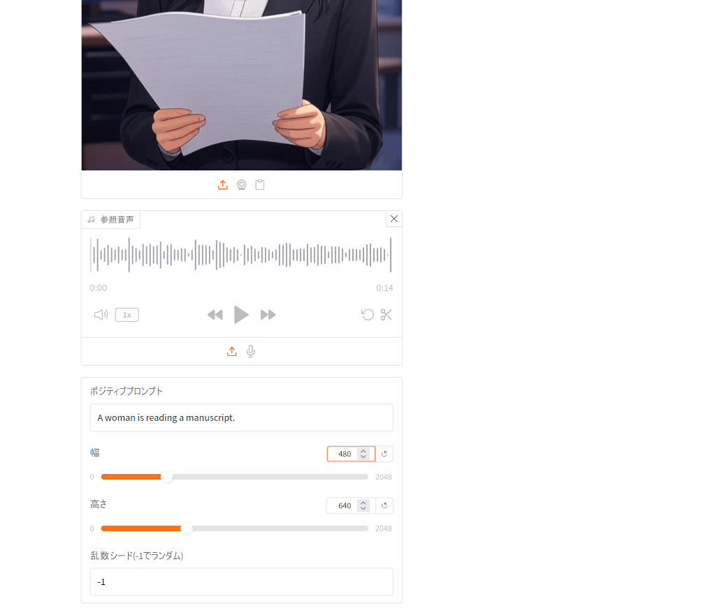

# 画像生成・動画生成

デフォルトでは`uimodule`フォルダに6つのモジュールがインストールされていて、
読み込むワークフローが`workflow`フォルダに置かれています。

対応する ComfyUI 用のワークフローは`sample`フォルダに同名で置かれているので、
ComfyUI の方で開けば同じワークフローを実行できます。

これらにより画像や動画を生成できます。

- 文章から画像生成(SD1.5、SDXL用)(10image01.py, image01.json)
- 画像と文章から画像生成(SD1.5、SDXL用)(10image11.py, image11.json)
- 画像1枚から画像生成(FLUXKontext専用)(10image21.py, image21.json)
- 画像2枚から画像生成(FLUXKontext専用)(10image22.py, image22.json)
- 画像を文章に基づき編集(Qwen-Image-Edit専用)(10image31.py)
- 開始画像から動画生成(Wan2.2 + Lightning専用)(20video01.py, video01.json)
- 開始画像と終了画像から動画生成(Wan2.2 + Lightning専用)(20video02.py, video02.json)
- 開始画像と音声と文章から動画生成(5秒)(Wan2.2 S2V + Lightning専用)(20video21.py, video21.json)
- 開始画像と音声と文章から動画生成(15秒)(Wan2.2 S2V + Lightning専用)(20video22.py, video22.json)


## 文章から画像生成(SD1.5、SDXL用)

[AUTOMATIC1111](https://github.com/AUTOMATIC1111/stable-diffusion-webui) に似た
UI で画像生成ができます。

チェックポイントで SD1.5 や SDXL のモデルを選択します。
LoRA は AUTOMATIC1111 と異なり、有効にチェックを入れ、使用する LoRA モデルを選択し、
モデルへの強度と、クリップへの強度を指定してください。

ComfyUI 起動後にモデルファイルを
`checkpoints` フォルダに入れた場合や LoRA モデルを`loras` フォルダに入れた場合、
そのままでは認識されないので、モデル更新を押してください。


ポジティブプロンプトに、生成したい画像に関する英単語をコンマ(,)で区切って入力し、
ネガティブプロンプトに、生成したい画像に含みたくない要素を英単語をコンマ(,)で区切って
入力してください。プロンプトの具体例は『sdxl プロンプト例』等で検索してください。

ポジティブプロンプト例:
```
1girl, anime coloring, official art
(少女、アニメ調、公式画像風)
```
ネガティブプロンプト例:
```
bad quality, worst quality, text, logo
(低品質、最低品質、文章、ロゴ)
```


幅と高さに生成したい画像の大きさを指定してください。

ステップ数や CFG、サンプラー、スケジューラーは必要に応じて設定してください。ノイズ除去は 1 にします。
乱数シードは -1 にするとランダム値になり、それ以外の数値ではその数値をそのまま使用します。

バッチカウントは指定した回数生成を行います。標準では 1 です。バッチサイズは
同時に生成する画像数です。標準では 1 です。増やすと指定した枚数の画像を同時に
生成できますが、生成時間が増え、消費する VRAM が増えるので、大きくしすぎると
エラーになります。


生成ボタンを押せば右の生成画像に画像が生成されます。


(注:ネガティブプロンプトがミスで log になっています)

生成された画像は `ComfyUI`フォルダの`output`フォルダに保存されます。

ComfyUIGradio の生成画像の上で右クリックして名前を付けて保存でも保存できますが、
ファイル名がview(拡張子なし)なので、適当なファイル名＋拡張子『.png』(tmp01.png等)で保存してください。

### LoRA を使う場合
DMD2 LoRA を使用する場合の例です。有効にチェックを入れて、DMD2 LoRA を選択し、
強度は両方 1.0　にします。サンプラーに lcm を指定し、CFG は 1、ステップ数は
4〜8ぐらいにしてください。


生成ボタンを押せば右の生成画像に画像が生成されます。


### 参考
ComfyUI で同じ処理を行うワークフローは`sample`フォルダの`image01.json`です。


## 画像と文章から画像生成(SD1.5、SDXL用)

左上の画像欄に画像をここにドロップまたはクリックして元となる画像のアップロードを
行ってください。アップロードした画像は `ComfyUI` フォルダの `input` フォルダに
保存されます。ここではさきほど生成した画像を使います。


残りの設定項目は文章から画像生成(SD1.5、SDXL用)と同じです。

ノイズ除去を上げると元の画像から大きく変化し、ノイズ除去を下げると元の画像に
より近い画像が生成されます。デフォルトは 0.75 にしています。1 にすると
元の画像を参照しないのと同じになります。

生成ボタンを押せば右の生成画像に画像が生成されます。

ポジティブプロンプト例:
```
1girl, anime coloring, official art, angry, teeth
(少女、アニメ調、公式画像風、怒り、歯)
```
ネガティブプロンプト例:
```
bad quality, worst quality, text, logo
(低品質、最低品質、文章、ロゴ)
```


## 画像1枚から画像生成(FLUX Kontext)

FLUX Kontext を利用して元画像の特徴などを利用して別な画像を生成します。


モデルを設定してください。`model_download.bat`でモデルをダウンロードした場合は
次のように設定してください。

|       | モデル名 |
|-------|-------|
|FLUX モデル | flux1-kontext-dev-Q4_K_M.gguf |
|テキストエンコーダ1 | clip_l.safetensors |
|テキストエンコーダ2 | t5-v1_1-xxl-encoder-Q4_K_M.gguf |
|VAE | clip_l.safetensors |ae.safetensors|


[ComfyUIのWiki](https://comfyui-wiki.com/ja/tutorial/advanced/image/flux/flux-1-kontext)より

をダウンロードして入力画像にアップロードしてください。

入力できる項目は画像と文章から画像生成(SD1.5、SDXL用)とだいたい同じですが、ポジティブプロンプトは
英単語を区切って指定するのではなく、英文で書きます。ネガティブプロンプトは使えません。

ポジティブプロンプト例:
```
Using this elegant style, create a portrait of a swan wearing a pearl tiara
and lace collar, maintaining the same refined quality and soft color tones.
(この優雅なスタイルを使用して、白鳥がパールのティアラとレースの襟を身に着けた肖像画を作成し、
同じ洗練された品質と柔らかな色調を維持してください。)
```

生成ボタンを押せば画像が生成されます。SDXL モデルより画像生成に時間がかかります。


白鳥の右手？が変ですが、元の画像の画風を保ちながらプロンプトの英文に従った画像が生成されています。
 
## 画像2枚から画像生成(FLUX Kontext)

2 枚の画像の特徴を利用して別な画像を生成します。

モデルは『画像1枚から画像生成(FLUX)』と同じ設定にします。

『文章から画像生成(SD1.5、SDXL用)』で生成した 2 人の少女画像をアップロードします。


次のプロンプトで画像を生成してください。画像のサイズは自動的に設定されます。画像を
並べる順番は`Dropdown`で指定できます。

ポジティブプロンプト例:
```
Place both cute characters together in one scene where they are hugging.
(両方の可愛いキャラクターを一つのシーンに配置し、抱き合っている姿を描いてください)
```


生成ボタンを押せば画像が生成されます。


## 画像を文章に基づき編集・生成(Qwen-Image-Edit)
Qwen-Image-Edit を利用して文章に基づき画像を編集・生成できます。

モデルを設定してください。`model_download.bat`でモデルをダウンロードした場合は
次のように設定してください。

|       | モデル名 |
|-------|-------|
|Qwen Image Edit モデル | Qwen_Image_Edit-Q4_K_M.gguf |
|テキストエンコーダ | Qwen2.5-VL-7B-Instruct-Q4_K_M.gguf |
|VAE | Qwen_Image-VAE.safetensors |

参照画像に開始画像をアップロードし、ポジティブプロンプトに編集内容を
日本語または英語または中国語で書いてください。中国語で書くのが一番画像に
反映されやすく、次が英語です。日本語で書いた場合うまくいかない場合が
多いので、そういう場合は Grok 等で編集内容を英語や中国語に翻訳して
プロンプト欄に入れてください。

入力画像が大きすぎたり小さすぎたりするとうまく編集できないので、入力画像の拡大縮小後の
総画素数(100万画素単位)を指定してください。標準では1.0(100万画素)に拡大縮小します。

画像とプロンプト例


```
画像の少女を左向きにしてください。
```
```
画像の背景を削除して、白背景にしてください。
```

編集ボタンを押せば画像が生成されます。


画像編集だけでなく、参照画像の画風を利用して画像生成するなどさまざまな活用方法があるので、『Qwen image edit 活用例』などで検索してみてください。
例えば、[「Qwen Image Edit」を使って何ができるか簡単に紹介します](https://note.com/yukyu_haruka/n/n70d4726027fc)などが参考になります。


## 開始画像から動画生成(Wan2.2)

画面サイズによってはタブがはみ出るので、右上の…を押してください。


開始画像と文章から動画を生成します。

モデルを設定してください。`model_download.bat`でモデルをダウンロードした場合は
次のように設定してください。LoRA は high 用 low 用それぞれ 1 つずつ指定できます。

|       | モデル名 |
|-------|-------|
|Wan モデル high | wan2.2_i2v_high_noise_14B_Q4_K_M.gguf |
|Wan モデル low | wan2.2_i2v_low_noise_14B_Q4_K_M.gguf |
|テキストエンコーダ | umt5-xxl-encoder-Q4_K_M.gguf |
|VAE | wan_2.1_vae.safetensors(Wan 2.2 ですが Wan 2.1 用の VAE で正しいです) |


開始画像をアップロードしてください。この例では『文章から画像生成(SD1.5、SDXL用)』で生成した画像を使います。

ポジティブプロンプトは、英語(または中国語)の文章で入力します。ネガティブプロンプトは使えません。

幅と高さとフレーム数を指定してください。フレーム数は動画の長さです。
1 秒 16 フレームなので、17 フレームで約 1 秒、33 フレームで約 2 秒、49 フレームで
約 3 秒となります。

wan2.2_i2v_lightx2v_4steps Lora が常に適用され、ステップ数 4、CFG 1、サンプラー euler、
スケジューラ simple は固定で動画生成します。

ここでは横:360 縦:640 時間:49 フレーム 約 3 秒で の動画を生成します。

ポジティブプロンプト例:
```
A girl is talking with smile.
(女の子が笑顔で話しています)
```


生成ボタンを押せば動画が生成されます。画像より生成時間がかかります。


## 開始画像と終了画像から動画生成

開始画像と終了画像と文章から動画を生成します。

モデルは『開始画像から動画生成(Wan2.2)』と同じように設定してください。

開始画像と終了画像をアップロードしてください。この例では『文章から画像生成(SD1.5、SDXL用)』で
生成した笑顔画像と怒り画像を使います。


設定項目は『開始画像から動画生成(Wan2.2)』と同じです。

横:360 縦:640 時間:49 フレーム 約 3 秒で の動画を生成します。

ポジティブプロンプト例:
```
A girl is talking and going to be angry.
(女の子が話していて、怒りそうになっています。)
```


生成ボタンを押せば動画が生成されます。


## 開始画像と音声と文章から動画生成(5秒用) (15秒用)
Wan 2.2 S2V を利用して開始画像に対して音声に対応する口パクなどの動画を
作成できます。

参照画像に開始画像をアップロードし、参照音声に使用する音声をアップロードしてください。
ポジティブプロンプトに動作の内容を英文で書き、幅や高さをしてしてください。
音声の長さに合わせて 5 秒用と 15 秒用からより近い長さの方を利用してください。

画像と音声例


[Style-Bert-VITS2](https://github.com/litagin02/Style-Bert-VITS2/) で音声合成。




生成ボタンを押せば動画が生成されます。


## 動作がおかしい場合

### モデルがない

『文章から画像生成(SD1.5、SDXL用)』用のモデルは model_download.bat でダウンロード
されないので、自身でダウンロードしてください。

### 実行時にエラーが出る場合

画像や動画のサイズは 8 の倍数か 16 の倍数でないとダメな場合があります。
サイズが大きすぎたり、小さすぎたりしてもエラーになります。

### ComfyUI の出力と ComfyUIGradio2 の生成時の表示が食い違うなど動作が変

Gradio でファイルを扱う際のファイルのキャッシュは Windows の場合標準では
`C:\ユーザ\ユーザ名\AppData\Local\gradio` です(隠しフォルダなのでエクスプローラーの
オプションを設定しないと表示されません)。

ComfyUI の出力と ComfyUIGradio2 の生成時の表示が食い違うなど、動作が
おかしくなっている場合、このフォルダを削除し、ブラウザのキャッシュを
削除し、ComfyUI と ComfyUIGradio2 を再起動してください。

## 拡張とカスタマイズ

`uimodule`フォルダ以下に、`10image01.py` などと同様の形式で.pyファイルを用意すれば自動的に
読み込まれます。

サンプルとして `test` フォルダ以下に、10image51.py と workflow/image51.json を
用意しました。`uimodule`フォルダ に 10image51.py、`workflow`フォルダに
workflow/image51.json をコピーして、ComfyUIGradio2 を再起動すれば、
『文章から画像を生成01』というタブが追加されるはずです。他と異なり、画像生成時にノードごとの
進捗状況が表示されるような修正がされています。

危険なモジュールも実行可能なので、セキュリティには気を付けてください。不用意に
`uimodule`フォルダ以下に*.pyファイルを置かないようにしてください。

拡張モジュールの開発については、[こちら](https://qiita.com/asfdrwe/items/569c9dab826ea6b03718)を参照してください。


